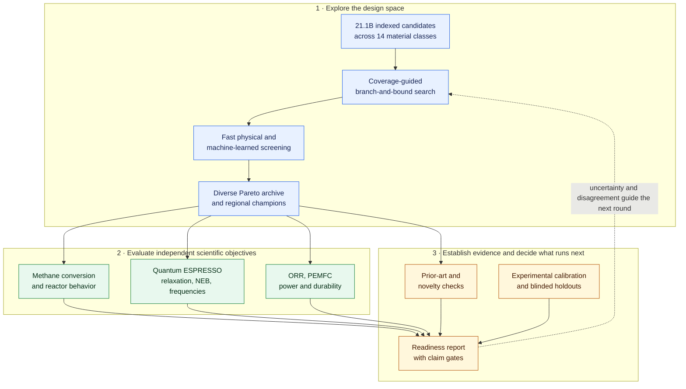
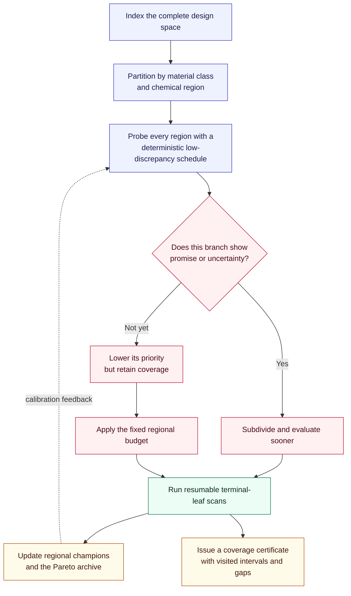
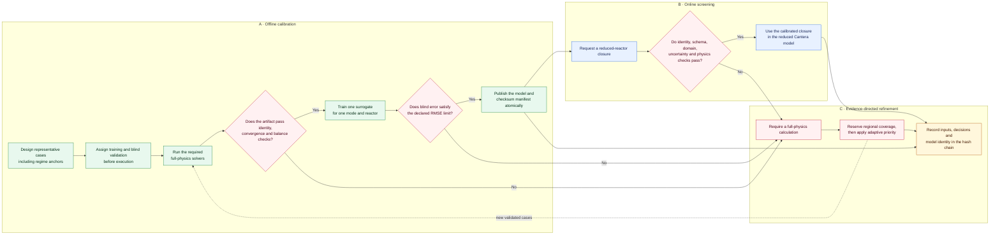
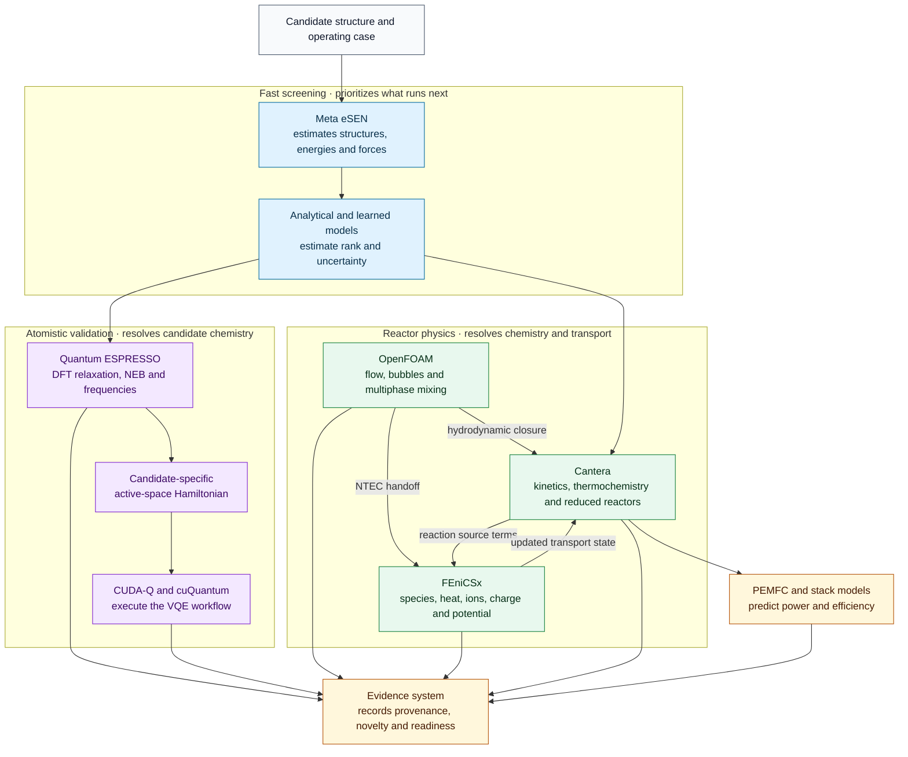
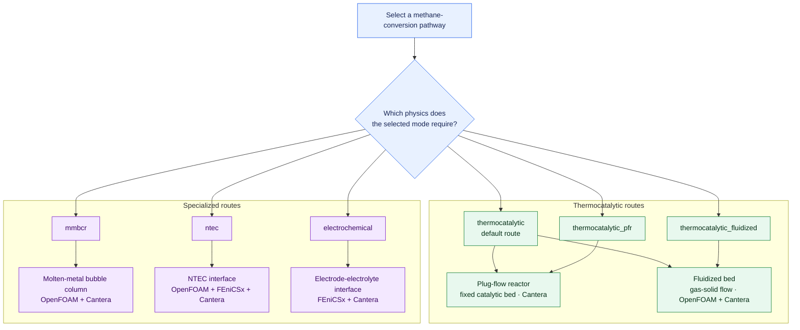
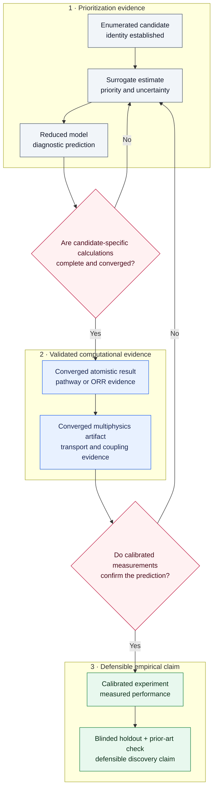
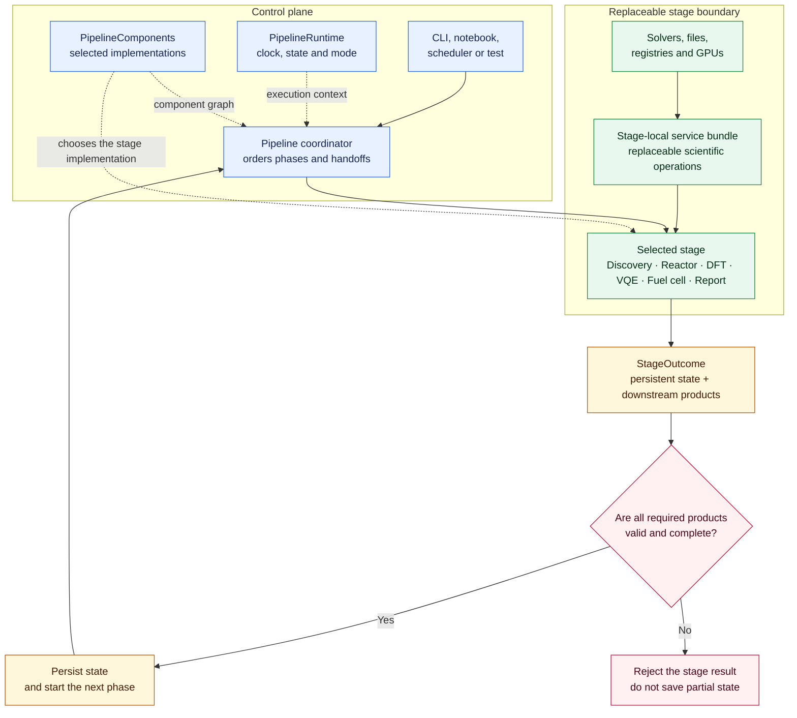
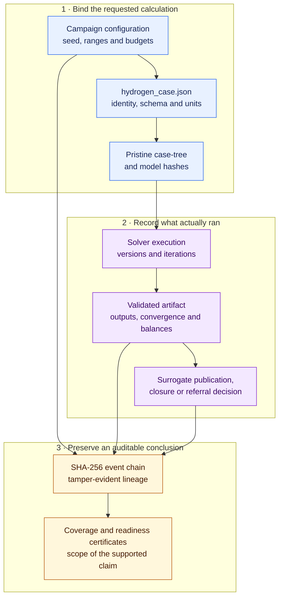
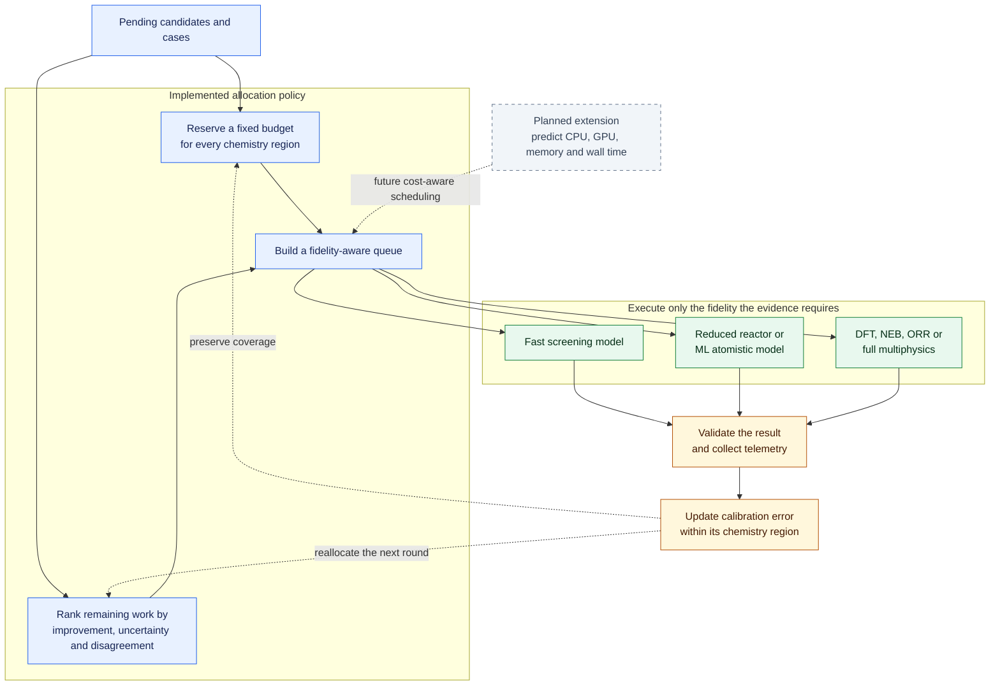

# Architecture and workflow visual atlas

These Mermaid diagrams describe what the engine executes, which tools own which
physics, how evidence gains authority, and where components may be replaced.
They render directly on GitHub while remaining reviewable, versioned text.

Read each diagram from top to bottom unless its arrows run left to right. Solid
arrows show execution or data flow; dashed arrows show feedback or a planned
extension. Blue denotes search or control, green denotes scientific execution,
amber denotes evidence, and red denotes a decision or rejection gate.

## End-to-end catalyst discovery engine

The archive deliberately fans out. Methane conversion, ORR, novelty, and
experimental readiness are distinct objectives; no single score proves all of
them.

## Divide-and-conquer traversal

Priority controls ordering and discretionary compute, not exclusion. Each
region retains a floor, and the certificate records what remains unvisited.

## Multi-fidelity learning and referral loop

Full physics always takes precedence. A surrogate supplies only a calibrated
transport closure; it is never relabeled as multiphysics evidence and never
authorizes candidate exclusion.

## Scientific software responsibilities

Cantera owns chemistry and reduced reactor kinetics. OpenFOAM owns resolved
flow and multiphase hydrodynamics. FEniCSx owns coupled continuum transport.
Quantum ESPRESSO owns plane-wave DFT. CUDA-Q/cuQuantum execute the selected
quantum workflow. None is a universal simulator.

## Methane-conversion mode routing

Mode selection chooses physics; it does not award performance. Material-bed
incompatibility produces a non-excluding, not-applicable result.

## Evidence authority ladder

Evidence advances only through completed gates. Enumeration, a favorable
surrogate, incomplete DFT, or a process exit code cannot become a discovery.

## Replaceable component architecture

The replacement tests run every phase independently, make every unselected
stage raise if called, verify production signatures, and reject malformed
handoffs before persistence.

## Provenance chain

The chain answers: what was requested, what exact inputs and software ran,
which checks passed, and which later decisions consumed that evidence.

## Compute allocation and escalation

Coverage floors and scientific feedback are implemented. Resource-cost
prediction remains a recommended extension and is shown here as intended
architecture, not completed scientific authority.
