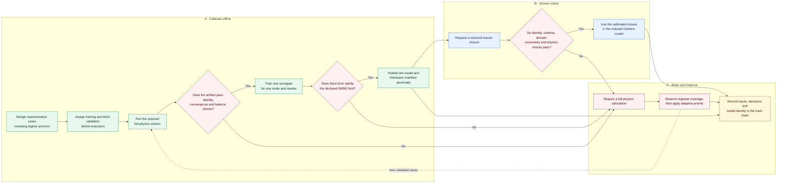

# Modular multi-fidelity reactor workflow

See the [architecture and workflow visual atlas](ARCHITECTURE_DIAGRAMS.md) for
the multi-fidelity loop, replaceable component boundaries, solver ownership,
and provenance diagrams corresponding to this document.

## Purpose

The pipeline has two different jobs that must not be conflated:

1. OpenFOAM and FEniCSx resolve expensive spatial transport physics for a
   carefully designed set of reactor cases.
2. Cantera evaluates chemical kinetics and reduced reactor models cheaply
   enough to screen many catalyst and operating-condition combinations.

The multi-fidelity layer connects those jobs without claiming that a learned
approximation is a full spatial calculation. It learns transport closures from
accepted full-physics artifacts, measures error on disjoint cases, and sends
unsupported queries back to full physics.

This component is intentionally not connected to hard candidate pruning. Its
output may prioritize the next calculation or supply a validated reduced-model
closure; it cannot establish novelty, experimental performance, or that a
candidate is chemically infeasible.

## Component boundaries

The intended data flow is:



Each boundary uses plain dictionaries, dataclasses, NumPy arrays, or JSON. A
unit test can therefore exercise case feature extraction, record extraction,
model fitting, prediction, serialization, and escalation without installing or
launching any external solver.

The candidate reactor stage has the same separation. `ReactorStageServices`
defines four injected operations: pathway resolution, candidate-kinetics
construction, mechanism writing, and reactor-sweep execution. Production uses
`default_reactor_services()` to load the existing implementations lazily. Tests
or alternate architectures can supply in-memory implementations without
changing `simulate_candidate`. `summarize_reactor_sweep` is a pure evidence
function and can be tested without any solver or file system.

The master coordinator now receives a `PipelineRuntime` for its clock, banners,
state loading/saving, and legacy pathway-environment selection. Configuration is
copied and normalized rather than mutated. Tests can therefore exercise resume
and persistence behavior with deterministic time and an in-memory state store.

DFT, VQE, and report generation expose independent stage functions and return a
shared immutable `StageOutcome`: `state` contains the small JSON-safe summary to
persist, while `products` contains in-process results for a downstream stage.
Their expensive validator or renderer is injectable. The CLI continues to use
the existing Quantum ESPRESSO, CUDA-Q, and report implementations by default.

Discovery, reactor-batch, and fuel-cell coordination follow the same contract.
Each has a small service bundle for its scientific operations. The master
coordinator receives a `PipelineComponents` graph containing all six stages and
the persisted-candidate loader, so a test, notebook, distributed scheduler, or
alternate campaign architecture can replace any stage without editing the
coordinator. The production graph is assembled lazily by
`default_pipeline_components()`.

The full graph is runtime-tested entirely in memory. That contract verifies the
discovery outputs handed to reactor and DFT stages, phase order, state
persistence after every phase, and the complete state presented to report
generation. Individual component tests then verify each stage's scientific
selection and failure semantics.

External solver process operations are represented by
`SolverExecutionServices`: preflight discovery, execution, OpenFOAM versioning,
FEniCSx command construction, and Cantera versioning can be supplied together.
Artifact admission is a separate `persist_validated_artifact` operation with
injectable path and validation functions. It writes by atomic replacement and
removes rejected evidence.

Reduced-reactor coupling uses `ReactorCouplingServices` for artifact loading,
mode-specific compatibility, and closure application. The closure adapter
independently rechecks candidate, pathway, reactor, and temperature identity.
Only established Fluidized/MMBCR hydrodynamic fields are copied into reduced
reactor configuration; specialized-mode evidence is attached without inventing
unavailable closure quantities.

## Full-physics artifacts as labels

`pipeline.process.multiphysics_runner` adds `surrogate_inputs` to every new
artifact. The snapshot contains a schema version, reactor type, unit-bearing
numeric geometry, operating and material-property inputs, and normalized feed
mole fractions.

The full `hydrogen_case.json`, source declarations, model choices, solver
versions, checksums, convergence evidence, balances, and holdout evidence remain
the authoritative scientific provenance. The compact snapshot exists so a
training row does not depend on locating a mutable case directory later.

Legacy artifacts without this snapshot remain valid reactor evidence. They are
not silently accepted for surrogate training; they must be regenerated or
paired through a separately reviewed migration with the exact original input.

`record_from_artifact` accepts only complete and converged artifacts with the
compatible snapshot and all outputs required for that reactor type. File-based
callers must first use `load_validated_artifact`, which applies the broader
solver, convergence, balance, calibration, and provenance contract.

## Model scope and separation

`fit_transport_surrogate` creates exactly one model for one pathway mode and one
reactor type. An MMBCR OpenFOAM relationship cannot be mixed with an NTEC
electro-transport relationship merely because two fields share a name. All rows
must have an identical feature schema.

The caller selects closure targets. Appropriate examples include gas velocity,
gas holdup, bubble fraction, bubble diameter, or validated transport-limited
response quantities. Targets should describe the relationship transferred into
the reduced model. A model must not be presented as candidate-specific reaction
truth unless its labels and features actually establish that relationship.

The portable baseline is a deterministic bootstrapped ridge ensemble over
standardized linear and quadratic features. Coefficients are auditable in JSON,
CPU fitting is inexpensive, and behavior is reproducible from a seed. More
complex models are justified only if they improve a blind holdout while
retaining uncertainty and applicability-domain behavior.

The initial allowlist is intentionally limited to the hydrodynamic outputs of
Fluidized and MMBCR cases. Current NTEC and electrochemical artifacts expose
overall conversion, selectivity, energy, current and voltage, but not separable
transport closure fields or candidate-specific kinetic descriptors. Treating
those overall outcomes as transport labels would confound catalyst chemistry
with reactor physics, so fitting them is rejected until the artifact contracts
are extended with the missing inputs and closure outputs.

## Calibration and escalation

Training and validation case identities must be disjoint. The model is rejected
if any target exceeds its caller-specified validation RMSE limit. Limits must
come from accuracy required by the downstream decision, not be chosen after
observing holdout results.

At inference the component returns either `surrogate_closure` or
`full_physics_required`. It escalates when the feature schema is wrong, the
point lies outside observed training bounds, ensemble uncertainty is excessive,
or a prediction is invalid. Every result declares
`candidate_exclusion_authorized: false`: referral adds a full-physics point; it
does not remove that chemistry region from search coverage.

Range checks are a conservative first applicability-domain guard. Before
campaign integration, add distance or density checks for sparse holes inside
the bounding box and calibrate uncertainty separately within meaningful
operating and chemistry regions.

## Selecting representative cases

A useful full-physics set should be designed rather than collected only from
current winners. For each mode:

1. reserve coverage across geometry, temperature, pressure, flow, phase and
   transport-property ranges;
2. include corners and known regime transitions such as fluidization onset;
3. keep entire physical cases or campaigns together in data splits;
4. reserve a final blind test never used for model or threshold selection;
5. add cases where the surrogate is uncertain or disagrees with full physics,
   while retaining a fixed exploration budget for every region; and
6. periodically recheck older regions so lower priority never means zero
   coverage.

OpenFOAM/FEniCSx results are computational labels, not experimental ground
truth. Experimental calibration and holdouts remain necessary for real reactor
accuracy.

`design_representative_cases` implements the initial design as a deterministic
Latin hypercube over caller-supplied, unit-bearing linear or logarithmic ranges.
It also accepts explicit regime anchors, validates them against the declared
domain, and assigns stable content identities. The ranges and anchors remain a
scientific input: the designer provides coverage mechanics, not unsourced
physical limits.

After full-physics execution, `train_and_publish_transport_model` reloads every
declared case through the production artifact validator. Train/validation roles
must be assigned explicitly before fitting. One invalid artifact aborts the
whole run, so a convenient subset cannot silently replace the registered
dataset. A passing model and its manifest are then atomically published with
checksums, exact case identities, and validation errors.

`assign_case_partitions` deterministically assigns an exact holdout count from
stable case identities before any solver result is visible. This makes the
split reproducible and prevents result-aware reassignment.

`schedule_full_physics_cases` supports subsequent iterations. It first spends a
fixed budget in every represented chemistry or operating region. Remaining
calculations are ranked by expected improvement, predictive uncertainty,
regional calibration error, and surrogate/full-physics disagreement. A history
of unproductive results reduces only this discretionary score; it never removes
the region's coverage allocation or authorizes candidate exclusion.

`run_multifidelity_iteration` is the architecture-neutral controller for the
complete loop. Injected services execute each prepartitioned case, validate and
publish the accumulated evidence, reload the exact model identity, screen
queries, allocate referrals, and append start/completion events. Prior validated
references may be supplied on later iterations so retraining accumulates
evidence rather than forgetting earlier cases.

`CampaignLedger` stores those events by atomic replacement in a SHA-256 hash
chain. Each start event hashes the exact case plans and screening queries; each
completion event records the model, train/validation identities, decisions,
and referrals. Altering any earlier event invalidates the chain.

## Integration status

Implemented and independently testable now:

- versioned extraction of numeric case inputs;
- strict conversion of an accepted artifact into a training record;
- mode/reactor and feature-schema isolation;
- disjoint validation identities and RMSE acceptance gates;
- ensemble uncertainty and training-range escalation;
- portable JSON save/load;
- an explicit prohibition on surrogate-driven candidate exclusion;
- deterministic stratified representative-case design with regime anchors;
- fail-closed validated-artifact ingestion, preassigned holdouts, and atomic
  model publication;
- fixed regional full-physics coverage plus feedback-directed allocation;
- a complete injectable execute/train/screen/refer iteration controller with
  accumulated evidence;
- atomic, tamper-evident campaign lineage;
- replaceable external-solver execution and artifact persistence;
- replaceable, identity-checked reactor coupling;
- independently runnable discovery, reactor, DFT, VQE, fuel-cell, and report
  stages; and
- a replaceable six-stage orchestration graph with in-memory runtime support.

Still requiring campaign data or additional integration:

- curated apparatus case directories and scientifically reviewed campaign
  configuration to supply to the implemented production case-plan adapter;
- calibrated physical ranges, regime anchors, RMSE limits, and representative
  OpenFOAM/FEniCSx case results;
- additional NTEC/electrochemical artifact fields before those modes can train
  transport closures; and
- blind experimental calibration.

The reduced Fluidized/MMBCR reactor path can consume an accepted surrogate
closure now, while keeping it distinct from full multiphysics evidence. Full
physics always takes precedence; out-of-domain, uncertain, nonphysical, or
identity-mismatched predictions are referred back to a solver calculation.

## Tests

```bash
conda run -n fairchem-env python test_modular_multiphysics.py
conda run -n fairchem-env python test_component_replacement_contracts.py
conda run -n fairchem-env python test_architecture_unit_contracts.py
```

The suite verifies a known synthetic relationship, JSON round trips,
out-of-domain and schema escalation, data-leakage and cross-mode rejection,
failed-holdout rejection, snapshot extraction, legacy artifact refusal, and
unsafe serialized-model refusal. It also exercises the complete controller in
memory, accumulated-evidence retraining, the production adapter boundary,
coverage-preserving referral allocation, and tamper detection in campaign
lineage.

The replacement integration suite treats modularity as a runtime contract. It
runs phases 1 through 6 one at a time with every unselected component replaced
by a function that raises if called. This proves that each phase owns only its
declared dependencies. It also verifies independent candidate restoration for
reactor and DFT restarts, rejects non-`StageOutcome` values and missing product
handoffs at the named stage boundary, and confirms that a rejected stage does
not persist partial state.

The architecture unit suite checks the smaller adapter boundaries. It imports
every module in a clean child interpreter after replacing process-launch APIs
with forbidden sentinels, verifies that production service factories bind every
required callable, proves the memory state adapter deep-copies nested state,
and exercises a real CSV candidate handoff where unresolved candidates remain
eligible for validation but cannot enter the quantitative reactor route.
